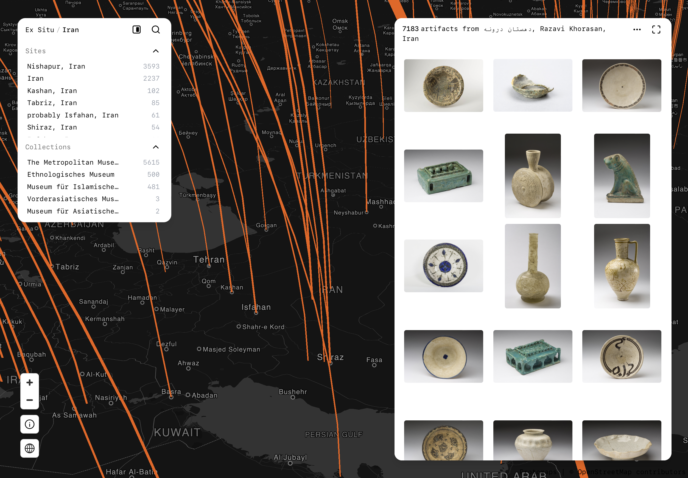

# Ex Situ

**A spatial index of displaced cultural artifacts — mapped from origin site to holding institution.**

[](LICENSE)
[](https://nextjs.org)
[](https://strapi.io)
[](https://postgis.net)



→ [exsitu.app](https://exsitu.app)

---

**Status:** Actively developed. Started as an MA thesis in 2022, now indexing 145,000+ artifacts across 9 collections.

---

Museums across Europe and North America hold hundreds of thousands of artifacts whose provenance — where they came from, under what circumstances — remains buried in institutional databases, invisible to researchers and the public.

Ex Situ makes this visible: not by duplicating institutional data, but by indexing the relationships between origin sites and destination collections as a spatial commons — connective tissue between archives that were never designed to speak to each other.

---

## How It Works

Ex Situ is a Relational Spatial Index — an indexer, not a hoster. Images are never duplicated; every artifact's image links directly to its source institution. Structured metadata (place, date, institution, inventory number) is indexed locally to power search and mapping, but always routes back to the institution's own record for full details.

| Concept | Description |
|---------|-------------|
| **Artifact** | Artifact record with resolved origin coordinates |
| **Arc** | Directional provenance connection: origin site → destination institution |
| **Resolver** | ETL pipeline that ingests and geolocates collection data |

The map renders arcs at three zoom levels:

| Zoom | View | Arc Logic |
|------|------|-----------|
| 0–4 | Global | Territory → Institution |
| 5–9 | Regional | City/Site → Institution |
| 10+ | Artifact | Precise coordinates |

---

## Tech Stack

| Layer | Technology |
|-------|------------|
| Frontend | Next.js 15, TypeScript, Deck.gl, MapLibre GL JS |
| Styling | Radix UI, Tailwind CSS, IBM Plex Mono |
| Backend | Strapi v4, Node.js |
| Database | PostgreSQL 16 + PostGIS |
| Maps | Protomaps (PMTiles) |
| ETL | Python — geocoding, normalization, fuzzy matching |
| Hosting | Hetzner (self-hosted) |

---

## API

```
GET https://exsitu.app/api/museum-objects/geospatial
```

| Parameter | Type | Required | Description |
|-----------|------|----------|-------------|
| `zoom` | integer | ✅ | Zoom level (0–20) |
| `minLon` | float | zoom ≥ 5 | Bounding box min longitude |
| `minLat` | float | zoom ≥ 5 | Bounding box min latitude |
| `maxLon` | float | zoom ≥ 5 | Bounding box max longitude |
| `maxLat` | float | zoom ≥ 5 | Bounding box max latitude |
| `institution` | string | — | Filter by institution name(s), comma-separated |
| `country` | string | — | Filter by origin territory |
| `city` | string | — | Filter by origin city |

Example — all Egyptian artifacts in the Antikensammlung:
```
GET https://exsitu.app/api/museum-objects/geospatial?zoom=4&country=Egypt&institution=Antikensammlung
```

Example response:
```json
{
  "type": "statistics",
  "data": [{
    "place_name": "Egypt",
    "latitude": 26.82,
    "longitude": 30.80,
    "institution_name": "Antikensammlung",
    "institution_latitude": 52.51,
    "institution_longitude": 13.39,
    "object_count": 847,
    "type": "arc"
  }]
}
```

---

## Quick Start

**Prerequisites:** Node.js ≥ 18, PostgreSQL 16+ with PostGIS, Python 3.10+

```bash
# 1 — Clone
git clone https://github.com/hburakyel/ex-situ.git
cd ex-situ

# 2 — Configure
cp backend/.env.example backend/.env
# fill in database credentials and secret keys
# set NEXT_PUBLIC_API_BASE_URL in frontend/.env

# 3 — Database
psql -U postgres -c "CREATE USER exsitu WITH PASSWORD 'yourpassword';"
psql -U postgres -c "CREATE DATABASE exsitu_db OWNER exsitu;"
psql -U postgres -d exsitu_db -c "CREATE EXTENSION postgis;"
psql -U postgres -d exsitu_db -c "CREATE EXTENSION pg_trgm;"
psql -U exsitu -d exsitu_db -f backend/database/migrations/001_add_postgis_geometry.sql

# 4 — Backend
cd backend && npm install && npm run develop

# 5 — Frontend
cd frontend && pnpm install && pnpm dev
```

---

## Project Structure

```
ex-situ/
├── frontend/               # Next.js app
│   ├── app/                # App Router pages + API proxy routes
│   ├── components/         # Map, artifact grid, search palette
│   ├── hooks/              # Data fetching, arc worker, URL state
│   ├── workers/            # Web Worker for arc processing
│   └── lib/                # API client, design system, Protomaps style
├── backend/                # Strapi + custom geospatial API
│   ├── src/api/museum-object/  # Controllers, services, routes
│   ├── database/migrations/    # PostGIS schema migrations
│   └── scripts/            # Data migration and admin scripts
└── etl/                    # Python ETL pipeline
    ├── scrape_smb_am_api.py
    ├── scrape_met_api.py
    ├── scrape_vam.py
    ├── postgis_geocoder.py
    └── normalize_place_names.py
```

---

## ETL — Adding a Resolver

Each institution is ingested by a self-contained resolver in `etl/`. The pattern is always the same:

1. **Fetch** — paginate the institution's public API
2. **Map** — extract `title`, `place_name`, `object_date`, `image_url`, `source_url`
3. **Geocode** — resolve `place_name` → `(latitude, longitude)` via the shared geocoding pipeline
4. **Insert** — bulk-upsert into `museum_objects`

To add a new institution, copy an existing resolver and adapt the API client and field mapping. Full setup instructions are in [etl/README.md](etl/README.md).

---

## Self-Hosting

Fully self-hostable. No proprietary cloud dependencies.

- Map tiles: Protomaps CDN or self-hosted PMTiles
- Geocoding: local Nominatim / PostGIS gazetteer
- No third-party analytics or tracking
- Production: Nginx reverse proxy + Let's Encrypt SSL

---

## Contributing

Contributions welcome, particularly:

- New institution resolvers — see [etl/README.md](etl/README.md) for the pattern
- Geocoding improvements for historical place names
- Frontend performance optimizations
- Translations of non-English place name variants

Open an issue before submitting a pull request.

See [COLLECTIONS.md](COLLECTIONS.md) for the full collection roadmap.

---

## Attribution

- [Protomaps](https://protomaps.com) — PMTiles (BSD 2-Clause)
- [MapLibre GL JS](https://maplibre.org) — WebGL map rendering (BSD 2-Clause)
- [Deck.gl](https://deck.gl) — geospatial visualization (MIT)
- [OpenStreetMap contributors](https://openstreetmap.org) — base map data (ODbL 1.0)
- [Nominatim](https://nominatim.org) — geocoding
- [Natural Earth](https://naturalearthdata.com) — public domain geodata

**Institutional data sources:** Staatliche Museen zu Berlin (SMB-Digital), The Metropolitan Museum of Art (CC0), Victoria and Albert Museum, Art Institute of Chicago (CC0), and others — see the map for the full, current list of indexed collections.

---

## Funding

- **HAB (Hessen-Abschlussförderung)**, 2022 — supported early research during the project's inception as an MA thesis.

---

## Acknowledgments

Thanks to Lea Steinkampf and A. Erdem Şentürk for their contributions to this project.

---

## License

Copyright © 2026 Hüseyin Burak Yel
[GNU Affero General Public License v3.0](LICENSE)
